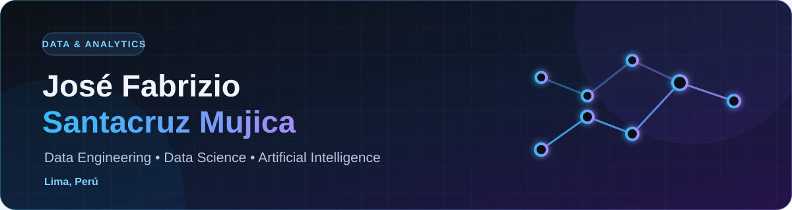

<div align="center">
  
</div>

<div align="center">
  <a href="https://www.linkedin.com/in/jose-fabrizio-santacruz-mujica/"></a>
  <a href="https://josesantacruzmujica.org"></a>
  <a href="https://github.com/JoseFabrizioS"></a>
</div>

<p align="center">
  <strong>Ingeniería de Datos · Ciencia de Datos · Inteligencia Artificial</strong><br />
  <sub>Transformo datos, procesos y necesidades de negocio en soluciones analíticas confiables y escalables.</sub>
</p>

---

## `./sobre_mí`

Soy estudiante de **Ingeniería Industrial en la Universidad Peruana de Ciencias Aplicadas (UPC)**, con experiencia en Data & Analytics y especial interés en el ciclo completo del dato: arquitectura, automatización, analítica, ciencia de datos e inteligencia artificial.

Durante mi experiencia en **Cementos Pacasmayo** trabajé con modelado de datos en BigQuery, automatización con Apps Script y n8n, documentación de linaje y despliegues mediante Azure DevOps. Mi enfoque combina criterio de negocio, pensamiento analítico y construcción técnica para convertir información compleja en decisiones claras y procesos más eficientes.

```yaml
perfil:
  ubicación: "Lima, Perú"
  enfoque: ["Data Engineering", "Data Science", "Artificial Intelligence"]
  formación_base: "Ingeniería Industrial"
  intereses: ["Arquitecturas de datos", "Machine Learning", "MLOps", "Automatización"]
  objetivo: "Construir productos de datos útiles, mantenibles y con impacto real"
```

<details>
<summary><strong>English summary</strong></summary>
<br />

Industrial Engineering student at UPC with hands-on Data & Analytics experience. I am interested in building reliable data products across data engineering, data science and applied AI—connecting technical solutions with measurable business value.

</details>

---

## `tech_stack.json`

### Datos y analítica


### Ingeniería, IA y automatización


### Entrega y herramientas de negocio


---

## `experiencia.log`

<details open>
<summary><strong>Cementos Pacasmayo S.A.A. — Practicante de Data & Analytics</strong> · dic. 2025 – ago. 2026</summary>
<br />

- Desarrollé soluciones analíticas en **BigQuery**, incluyendo modelado de datos, vistas, tablas y procedimientos almacenados.
- Implementé flujos de entrega con **Azure DevOps** para llevar desarrollos a producción de forma controlada.
- Automaticé documentación de linaje de datos con **Apps Script** y validaciones de integridad entre Jira y SysAid con **n8n**.
- Optimicé cargas incrementales, frecuencias de actualización y componentes de arquitectura para distintas plantas.

</details>

<details>
<summary><strong>Comercial Importadora Luis A. Mayorga S.A.C. — Asistente Administrativo</strong> · jul. 2021 – dic. 2022</summary>
<br />

- Semi-automaticé la emisión de facturas y notas de crédito mediante Excel.
- Digitalicé libros de compras para mejorar la trazabilidad y consulta de información administrativa.

</details>

---

## `formación.md`

- 🎓 **Universidad Peruana de Ciencias Aplicadas (UPC)** — Ingeniería Industrial · 2023 – actualidad
- 📊 **ESAN Graduate School of Business** — Diploma en Data & Analytics · 2026 – actualidad
- 🧠 **Oracle Next Education + Alura Latam** — Especialización en Data Science · 2025 – actualidad
- 🌍 **Aspire Leaders Program** — Programa internacional de liderazgo · 2025

### Credenciales destacadas

- **Oracle Cloud Infrastructure 2025 Certified AI Foundations Associate**
- **Data Science Foundations** — IBM / Coursera
- **Supply Chain Analytics** — Rutgers University / Coursera
- Formación complementaria en **Power BI, SQL Server, Python, Machine Learning y Scrum**

---

## `comunidad_y_liderazgo`

- **SupplyLab UNMSM** — Colaborador en Logística y Finanzas · 2025 – actualidad
- **Grupo Global SCM** — Colaborador en iniciativas de Supply Chain Management · 2025

---

## `proyectos/` 🚧

> Esta sección está preparada para crecer. Por ahora estoy organizando proyectos reproducibles y bien documentados; prefiero publicar casos completos antes que llenar el perfil con demostraciones incompletas.

Próximamente encontrarás proyectos de:

- **Ingeniería de Datos:** pipelines ETL/ELT, calidad, modelado y observabilidad.
- **Ciencia de Datos:** análisis exploratorio, experimentación y evaluación de modelos.
- **IA aplicada:** servicios de inferencia, automatización inteligente y MLOps.

Cada proyecto incluirá contexto de negocio, arquitectura, decisiones técnicas, resultados, instrucciones de ejecución y aprendizajes. Mientras tanto, puedes explorar mis [repositorios públicos](https://github.com/JoseFabrizioS?tab=repositories).

---

## `actualmente`

- 🔭 Construyendo un portafolio técnico centrado en datos e IA aplicada.
- 🌱 Profundizando en arquitectura de datos, Machine Learning y MLOps.
- 🤝 Abierto a colaborar en iniciativas de analítica, automatización y productos de datos.
- 💬 Interesado en conversar sobre BigQuery, Python, SQL, Power BI y mejora de procesos basada en datos.

---

<div align="center">
  <strong>Convirtamos datos en decisiones y decisiones en impacto.</strong>
  <br /><br />
  <a href="https://www.linkedin.com/in/jose-fabrizio-santacruz-mujica/">LinkedIn</a>
  &nbsp;·&nbsp;
  <a href="https://josesantacruzmujica.org">Portafolio</a>
  &nbsp;·&nbsp;
  <a href="https://github.com/JoseFabrizioS">GitHub</a>
</div>
